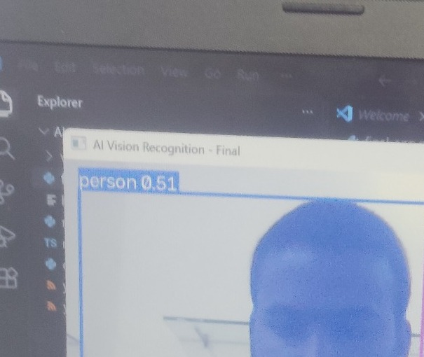
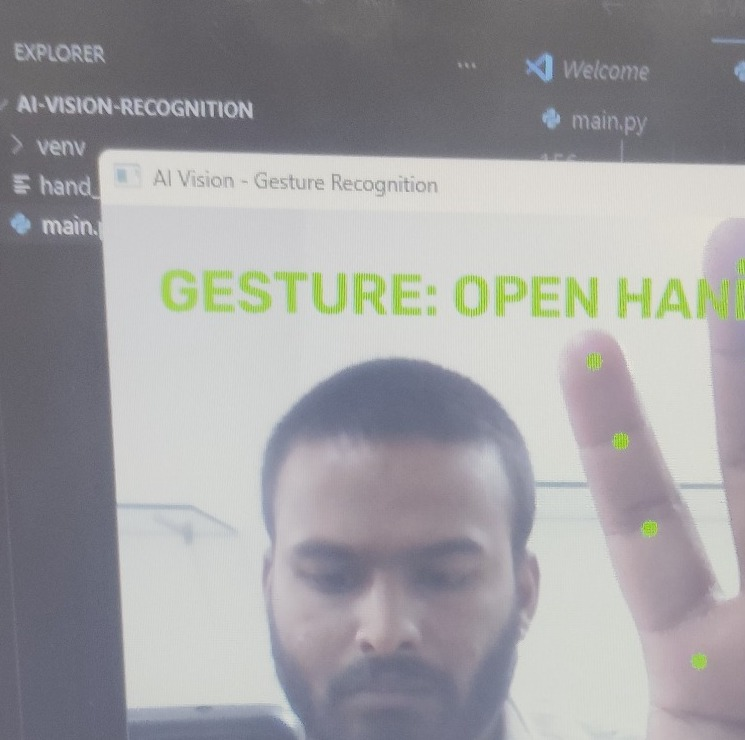
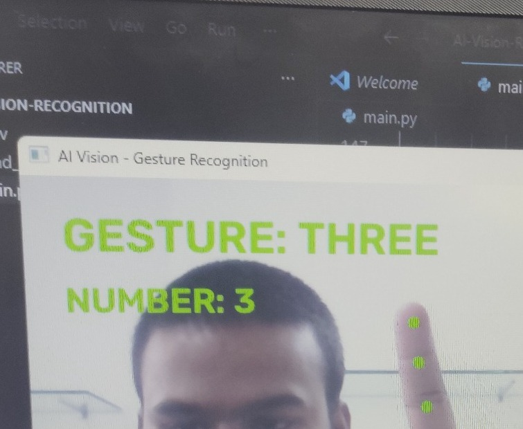
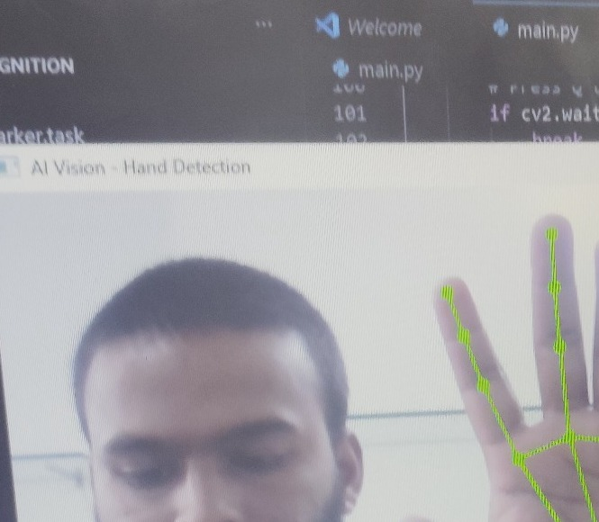

# AI Vision Recognition

AI Vision Recognition is a real-time computer vision project built with Python.

The application uses a webcam to detect hand landmarks, recognize hand gestures,
count fingers, and identify objects in real time.

## Features

- Hand landmark detection
- Finger counting from 0 to 5
- Hand gesture recognition
- Open-vocabulary object detection
- Real-time webcam processing
- Object confidence scores
- Calendar, phone, bottle, book and other object recognition

## Technologies Used

- Python
- OpenCV
- MediaPipe
- Ultralytics YOLOE
- NumPy
- Git & GitHub

## Project Structure

```text
AI-Vision-Recognition/
│
├── venv/
├── hand_landmarker.task
├── main.py
├── object_detection.py
├── final_app.py
├── README.md
└── requirements.txt

How It Works:
1. Hand Detection
MediaPipe detects the hand and identifies 21 hand landmarks.

2. Finger Counting
The application analyzes the hand landmarks and counts raised fingers.
Example:
FINGERS: 3

3. Gesture Recognition
The application recognizes basic hand gestures such as:

FIST
OPEN HAND
PEACE
POINT
THUMBS UP
THUMBS DOWN

4. Object Recognition
YOLOE is used for real-time object detection.

Example objects include:
Person
Cell phone
Calendar
Bottle
Book
Laptop
Keyboard
Mouse
Chair
Watch

Installation:
Create and activate a Python virtual environment:
python -m venv venv

Activate it on Windows:
.\venv\Scripts\Activate.ps1

Install the required packages:
pip install opencv-python mediapipe numpy ultralytics

Run the Application

Activate the virtual environment and run:
python final_app.py

The webcam will open automatically.
Press:
Q
to close the application.

Example Output
The application can display information such as:
GESTURE: PEACE
FINGERS: 2
person 0.89
cell phone 0.82
bottle 0.91
calendar 0.76

## Project Screenshots

### Object Detection


### Open Hand Gesture


### Finger Counting


### Hand Landmarks


Future Improvements:
Improve gesture recognition accuracy
Add more hand gestures
Add voice output
Add custom object detection
Add a graphical user interface
Improve performance on low-end computers
Add support for more objects
Deploy the application as a desktop or web application

Author:
Developed as an AI and Computer Vision project using Python.

License:
This project is intended for educational and portfolio purposes.

Step 2 — Create `requirements.txt`

Right-click your project folder again → **New File** → name it:
```text
requirements.txt

Paste:
opencv-python
mediapipe
numpy
ultralytics

